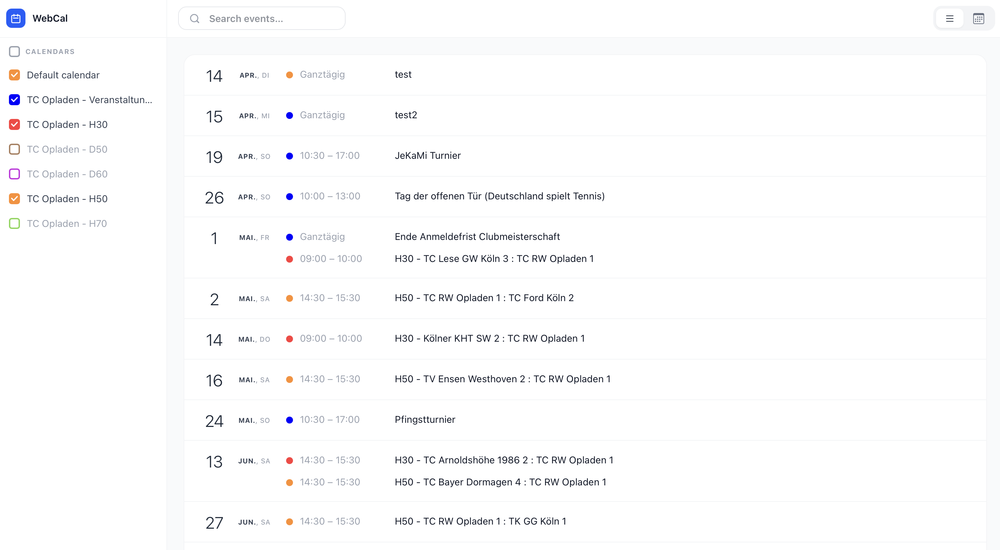
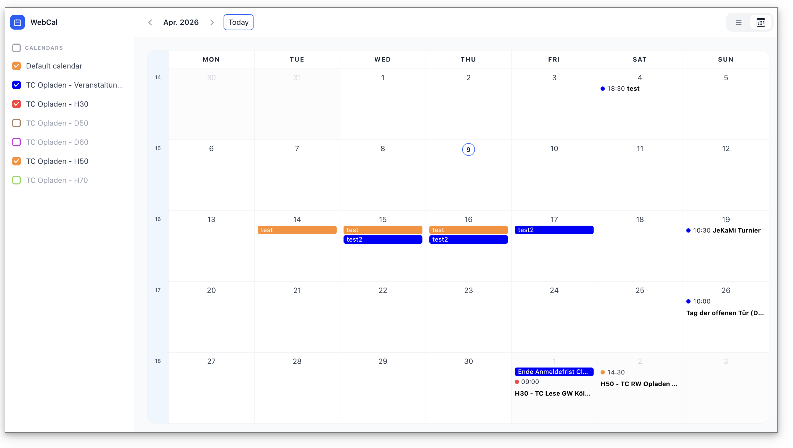
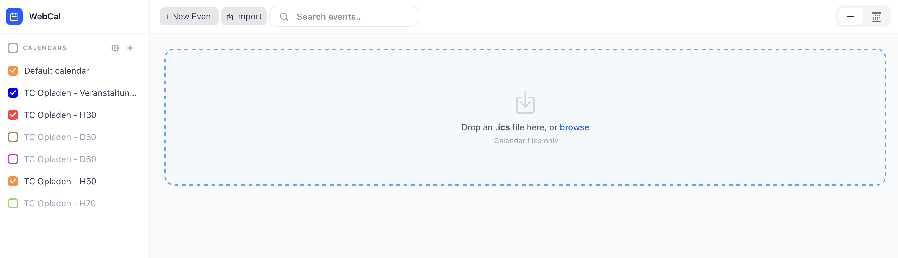

# WebCal

A lean, self-hosted web frontend for CalDAV calendars. No framework, no database, no build step required to deploy — just PHP and a CalDAV server.

> **Personal project, shared as-is.** No guarantees of support or continued development. Feature requests may not be implemented.

---

## What it does

WebCal connects to any CalDAV server and gives you a clean, responsive calendar interface in the browser — with list and month views, event creation and editing, ICS import, and a read-only public view you can share without exposing admin access.

---

## Features





- **List and month views** with smooth navigation
- **Create, edit, and delete events** across multiple calendars
- **Import** events from `.ics` files
- **Search** across events in both views
- **Public read-only view** — share your calendar without giving anyone login access
- **Public ICS URLs** — subscribe to individual calendars from any calendar app
- **Modern, fully responsive layout** — works on desktop and mobile

---

## Requirements

- A web server with **PHP 8.0+** and the `curl` extension enabled
- A **CalDAV server** — [Baïkal](https://sabre.io/baikal/) is recommended

---

## Installation

WebCal deploys as **7 files** with no dependencies to install.

### 1. Upload these files to your web server

```
index.php
api.php
app.js
styles.css
custom.css
.htaccess
config.json        ← you create this (see next step)
```

### 2. Create your config

Copy `config.example.json` to `config.json` and fill in your details:

```json
{
    "caldav": {
        "url": "https://www.your-caldavserver-hostname.com",
        "username": "your-caldav-user",
        "password": "your-password",
        "calendar_home": "/path-to-your-baikal-folder/dav.php/calendars/your-caldav-user/"
    },
    "week_start": "monday",
    "users": [
        {
            "username": "editor1",
            "password_hash": null,
            "display_name": "Your Name"
        }
    ]
}
```

| Field | Description |
|-------|-------------|
| `caldav.url` | Base URL of your CalDAV server |
| `caldav.username` | CalDAV account username |
| `caldav.password` | CalDAV account password |
| `caldav.calendar_home` | Path to your calendars collection (Baïkal: `/path-to-folder/dav.php/calendars/<user>/`) |
| `week_start` | `"monday"` or `"sunday"` |
| `users` | WebCal login accounts (independent of CalDAV credentials) |

**First login:** Set `password_hash` to `null` — WebCal will prompt you to choose a password on first sign-in and update the config automatically.

### 3. Open in your browser

- **Admin login:** `https://yoursite.com/webcal/?admin`
- **Public view:** `https://yoursite.com/webcal/`

---

## Admin vs. public view

Visiting the URL without `?admin` shows a read-only public view — no login required, no edit controls visible. Only the admin (logged-in) view can create, edit, or delete events. Both views read calendar data from the same CalDAV backend.

---

## Limitations

- **Recurring events** are displayed but cannot be edited or deleted (yet). The edit form is disabled for them.
- **Single CalDAV account** — all calendars belong to one CalDAV user (see Non-goals).

---

## Non-goals

- **No multi-user support.** WebCal is designed for a single CalDAV account. Multiple WebCal login users all read and write the same calendars.
- **No CalDAV server included.** You need to bring your own. [Baïkal](https://sabre.io/baikal/) is a good self-hosted option.

---

## License

MIT
